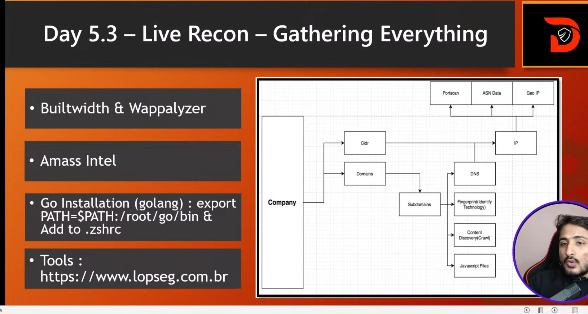

# Recon Tools Cheat Sheet

A professional cheat sheet covering commonly used reconnaissance and technology fingerprinting tools used in ethical hacking, OSINT, and bug bounty workflows.

> For educational purposes and authorized security testing only.

---

# 1. Amass

## Overview
Amass is one of the most powerful reconnaissance and attack surface mapping tools.

It is widely used for:
- Subdomain enumeration
- Infrastructure mapping
- ASN intelligence
- Organization asset discovery
- DNS enumeration

---

## Installation

```bash
sudo apt install amass
```

---

# Amass Intel

## Purpose
Used for gathering intelligence about organizations.

## Best Use Cases
- Discover related domains
- Find ASN information
- Identify organization-owned infrastructure
- Passive reconnaissance

## Example

```bash
amass intel -org Facebook
```

## Another Example

```bash
amass intel -d facebook.com
```

## Useful Flags

| Flag | Purpose |
|---|---|
| `-org` | Search organization assets |
| `-d` | Target domain |
| `-whois` | Perform Whois lookups |
| `-active` | Active reconnaissance |

---

# Amass Enum

## Purpose
Used for subdomain enumeration.

## Best Use Cases
- Discover subdomains
- Build attack surface
- Passive + active enumeration
- DNS mapping

## Example

```bash
amass enum -d facebook.com
```

## Passive Enumeration

```bash
amass enum -passive -d facebook.com
```

## Output Example

```text
api.facebook.com
m.facebook.com
developers.facebook.com
```

---

# 2. Whois

## Overview
Whois is used to retrieve registration and ownership information about domains.

---

## Command

```bash
whois facebook.com
```

---

## Best Use Cases

- Identify domain owner
- Discover registrar information
- Find registration dates
- Investigate DNS servers
- Gather organization details

---

## Important Information Found

| Data | Description |
|---|---|
| Registrar | Domain registration company |
| Name Servers | DNS servers |
| Creation Date | Domain registration date |
| Expiry Date | Domain expiration |
| Organization | Domain owner |

---

# 3. NSLookup

## Overview
NSLookup is a DNS query tool used for investigating DNS records.

---

## Basic Syntax

```bash
nslookup domain.com
```

---

## Best Use Cases

- DNS investigation
- Discover IP addresses
- Query DNS records
- Troubleshoot DNS issues

---

## Query Specific Record Types

### MX Records

```bash
nslookup -type=mx facebook.com
```

### TXT Records

```bash
nslookup -type=txt facebook.com
```

### Name Servers

```bash
nslookup -type=ns facebook.com
```

---

## Common DNS Record Types

| Record | Purpose |
|---|---|
| A | Maps domain to IPv4 |
| AAAA | Maps domain to IPv6 |
| MX | Mail server records |
| TXT | Verification & SPF records |
| NS | Name server records |
| CNAME | Alias records |

---

# 4. Wappalyzer

## Overview
Wappalyzer identifies technologies used by websites.

It helps detect:
- Frontend frameworks
- Backend technologies
- CMS
- JavaScript libraries
- Analytics tools
- Web servers

---

## Website

```text
https://www.wappalyzer.com
```

---

## Best Use Cases

- Technology fingerprinting
- Understanding application stack
- Identifying frameworks
- Recon before testing

---

## Example Technologies Detected

| Category | Example |
|---|---|
| Frontend | React, Vue |
| Backend | Node.js, PHP |
| CMS | WordPress |
| Analytics | Google Analytics |
| Web Server | Nginx, Apache |

---

# 5. BuiltWith

## Overview
BuiltWith is a technology profiling platform used to identify technologies running on websites.

---

## Website

```text
https://builtwith.com
```

---

## Best Use Cases

- Website technology detection
- Security reconnaissance
- Competitor technology analysis
- Infrastructure understanding

---

## Features

- Detect frameworks
- Identify JavaScript libraries
- Discover hosting providers
- Analytics identification
- CDN detection
- Server technology discovery

---

# BuiltWith Screenshot



---

# Recommended Recon Workflow

```text
Whois
   ↓
NSLookup
   ↓
Amass Intel
   ↓
Amass Enum
   ↓
Wappalyzer
   ↓
BuiltWith
```

---

# Professional Recon Tips

## 1. Start Passive First
Always begin with passive reconnaissance before active scanning.

---

## 2. Fingerprint Technologies
Understanding technologies helps identify:
- Attack surface
- Framework vulnerabilities
- Misconfigurations

---

## 3. Correlate Information
Combine:
- Whois
- DNS
- ASN
- Technology stack
- Subdomains

for deeper reconnaissance.

---

## 4. Document Everything
Maintain structured notes for:
- Domains
- IP addresses
- Technologies
- DNS records
- Infrastructure

---

# Ethical Reminder

Perform reconnaissance only on:
- Authorized systems
- Bug bounty programs
- Labs and practice environments

Unauthorized scanning or testing may violate laws and platform policies.

