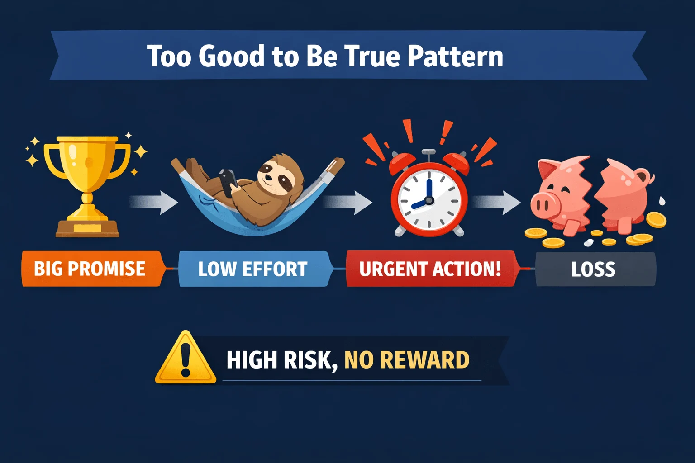

# Too Good To Be True Patterns

## Overview
Many fraud schemes succeed by offering opportunities that appear unusually attractive. These scams exploit emotions such as:
- Hope
- Greed
- Excitement
- Fear of missing out (FOMO)

When an offer promises **high rewards with little effort or risk**, people are more likely to ignore warning signs and make emotional decisions.

---

# What Does “Too Good To Be True” Mean? 🎯

Fraudulent offers often share common characteristics designed to bypass logical thinking.

## Common Warning Signs

| Red Flag | Description |
|---|---|
| **Guaranteed Success** 💰 | Promises of certain profits or rewards |
| **Little Effort Required** ⚡ | Claims of easy money or instant success |
| **Limited-Time Pressure** ⏱️ | Urgency forcing quick decisions |
| **Unrealistic Rewards** 🎁 | Rewards much larger than normal opportunities |
| **No Risk Claims** 🚫 | Statements like “100% safe” or “zero risk” |

---

# Key Insight 💡

> Legitimate opportunities always involve:
- Effort
- Risk
- Verification
- Uncertainty

If these elements are missing, caution is necessary.

---

# Psychological Pattern of Fraud 👀

Most scams follow a predictable emotional sequence:

| Stage | Description |
|---|---|
| **Attractive Offer** 🎯 | Exciting and unrealistic opportunity |
| **Urgency Introduced** ⏱️ | Pressure to act immediately |
| **Reduced Verification** ⚠️ | Victim skips careful checking |
| **Financial or Personal Loss** 💸 | Scam succeeds |

Fraudsters rely on emotions before logic can take control.

---

# Common Real-World Examples 🌍

| Scam Type | Typical Claim |
|---|---|
| **Investment Scams** 💹 | “Guaranteed high returns with zero risk” |
| **Job Scams** 💼 | “High salary for very little work” |
| **Prize & Giveaway Scams** 🎁 | “You’ve won a prize—pay a small fee first” |

---

# Why These Scams Are Effective ⚡

Too-good-to-be-true scams succeed because they:
- Trigger excitement quickly
- Create fear of missing out (FOMO)
- Reduce critical thinking
- Encourage rushed decisions
- Exploit optimism and trust

Once emotions dominate, verification is often ignored.

---

# Example: Crypto Giveaway Scam 🪙

## Fake Offer
> “Send 0.1 BTC and receive 1 BTC instantly. Limited time only.”

---

# Red Flags in the Offer 🚨

| Red Flag | Explanation |
|---|---|
| **Guaranteed Profit** 💰 | Unrealistic return with no risk |
| **Urgency** ⏱️ | “Limited time only” pressure |
| **No Verification** ⚠️ | No legitimate process or proof |
| **Impossible Promise** ❌ | Returns that make no logical sense |

Even if the branding appears professional, the structure of the offer itself reveals the scam.

---

# Key Takeaways 🔑

- Unrealistic rewards are major fraud indicators
- Excitement can weaken judgment
- Legitimate opportunities survive careful scrutiny
- Urgency and exclusivity are manipulation tactics
- Critical thinking is the best defense

---

# Best Practices ✅

## Protection Tips
- Pause before acting on exciting offers
- Verify opportunities independently
- Research companies and platforms carefully
- Avoid offers promising guaranteed profits
- Never send money under pressure

---

# Key Concepts ⭐

- **Too Good To Be True** = Offer promising unrealistic rewards
- Fraudsters exploit:
  - Greed
  - Hope
  - Excitement
  - FOMO
- Emotional decisions increase fraud risk
- Verification and skepticism reduce vulnerability

---

# Conclusion 📌

Too-good-to-be-true patterns are among the strongest indicators of fraud. Fraudsters intentionally design offers that appear highly rewarding while discouraging careful analysis.

When an opportunity feels unusually attractive:
- Pause
- Verify
- Think critically before acting

Awareness and skepticism are essential for preventing fraud and protecting personal or financial information.