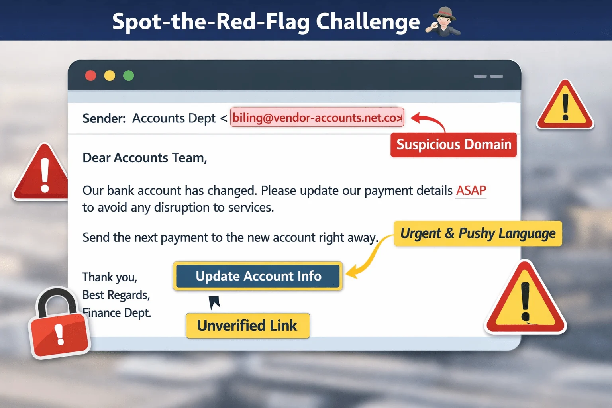

# Organizational Awareness and Procedures

## Overview
Fraud prevention is not only an individual responsibility — it also depends on understanding organizational processes and following established procedures.

Employees who understand:
- Their responsibilities
- Approval processes
- Reporting channels
- Security policies

are better prepared to detect and prevent fraud before it escalates.

---

# Key Areas of Organizational Awareness 🏷️

| Area | Description |
|---|---|
| **Know Your Role** 👥 | Understand your responsibilities and decision limits |
| **Approval Workflows** 📄 | Follow required verification and approval steps |
| **Escalation Channels** 📣 | Know who to contact when something seems suspicious |
| **Policies & Guidelines** 📚 | Follow rules for payments, communication, and data handling |

---

# Organizational Procedures in Practice ⚙️

## Payment Verification 💳
- High-value payments require multiple approvals
- Verify bank account changes independently
- Confirm unusual payment requests before processing

---

## Incident Reporting 📣
- Report suspicious emails, calls, or transactions immediately
- Escalate concerns through official reporting channels
- Early reporting helps reduce damage

---

## Access Control 🔐
- Access to systems and sensitive data should be role-based
- Elevated permissions require formal authorization
- Limit access to only what is necessary

---

## Documentation & Audit Trails 🗂️
- Maintain records of:
  - Approvals
  - Transactions
  - Communications
  - Account changes

Proper documentation supports investigations and audits.

---

# Organizational Spot-the-Red-Flag Challenge 🕵️‍♀️

## Scenario

You receive an email from a new vendor:

> “Our bank account has changed. Please update your records and process the next payment to the new account immediately.”

---

# Challenge Image 👀

---

# Red Flags to Consider ⚠️

| Red Flag | Explanation |
|---|---|
| **Suspicious Email Domain** 🌐 | Sender may not use an official company address |
| **Urgency** ⏱️ | Pressure to process payment immediately |
| **Workflow Bypass** ⚠️ | Attempts to avoid standard approval procedures |
| **No Verification** 🔍 | Account changes requested without confirmation |

---

# Safe Approach ✅

## Recommended Actions
1. Verify the vendor using official company records
2. Contact the vendor through trusted communication channels
3. Escalate the request to a supervisor or compliance team
4. Do not process payment until verification is completed

---

# Outcome 🌟

Following organizational procedures:
- Prevents fraudulent transfers
- Protects company assets
- Reduces operational risk
- Strengthens security culture

---

# Why Organizational Procedures Matter 💡

Fraudsters often target organizations by:
- Exploiting rushed workflows
- Bypassing approval steps
- Manipulating employees under pressure

Strong procedures create barriers that make fraud harder to succeed.

---

# Best Practices ✅

## Protection Tips
- Follow approval workflows consistently
- Never bypass verification procedures
- Report suspicious activity immediately
- Use official communication channels
- Maintain proper documentation

---

# Key Concepts ⭐

- Fraud prevention is a shared organizational responsibility
- Procedures exist to reduce risk and improve verification
- Approval workflows and escalation channels are essential defenses
- Verification is more important than convenience or speed
- Following procedures helps prevent financial and data loss

---

# Conclusion 📌

Effective fraud prevention combines:
- Individual awareness
- Organizational procedures
- Verification processes
- Clear communication channels

By understanding your role and consistently following organizational controls, you help create a safer and more secure environment for both employees and the organization.