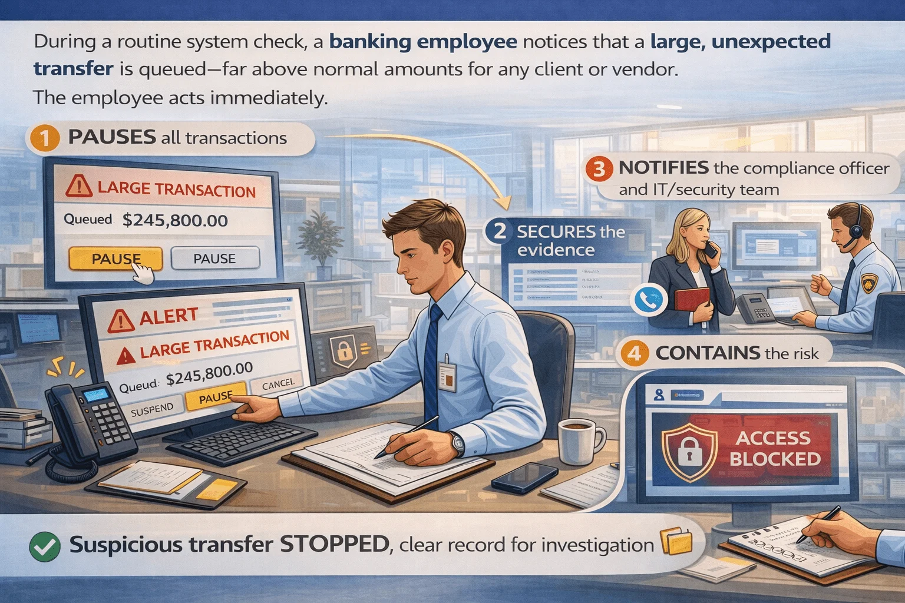

# Immediate Response to Suspected Fraud

## Overview
Responding quickly to suspected fraud is critical for minimizing:
- Financial loss
- Data exposure
- Operational disruption
- Reputational damage

Even small delays can increase the impact of a fraud incident. Knowing the correct response steps helps organizations contain threats quickly and effectively.

---

# Recognize When to Act 👀

Fraud response should begin when you notice:
- Unusual requests for money, access, or sensitive data
- Alerts from monitoring systems or colleagues
- Suspicious transactions or account activity
- Attempts to bypass normal procedures

---

# Important Insight 💡

> Suspicion alone is enough to trigger a response.  
> You do not need full confirmation before taking action.

---

# Immediate Steps to Take ⚡

---

# 1. Pause and Assess ⏸️

Stop all actions related to the suspicious activity immediately.

## Actions
- Avoid approving transactions
- Do not continue suspicious communications
- Prevent irreversible actions until verification is complete

## Why It Matters
Quick pauses reduce the chance of further damage.

---

# 2. Secure Evidence 🗂️

Preserve information that may help investigations.

## Actions
- Take screenshots
- Save emails and logs
- Record transaction details
- Preserve timestamps and communication history

## Why It Matters
Evidence supports investigations and incident analysis.

---

# 3. Notify the Right People 📣

Report suspicious activity through official channels.

## Contacts May Include
- Managers
- Compliance officers
- IT or security teams
- Fraud response teams

## Why It Matters
Rapid reporting enables faster containment and coordinated response.

---

# 4. Contain the Risk 🔒

Limit further exposure or financial damage.

## Actions
- Freeze accounts if necessary
- Restrict system access
- Pause suspicious transactions
- Isolate affected systems

## Why It Matters
Containment helps stop fraud from spreading or escalating.

---

# 5. Document Your Actions 📝

Maintain clear records of:
- Observations
- Actions taken
- Notifications made
- Timeline of events

## Why It Matters
Documentation improves accountability and supports investigations.

---

# Incident Response in Practice 🔧

## Visual Walkthrough

This diagram demonstrates the response process from:
- Detection
- Verification
- Containment
- Reporting
- Documentation

---

# Example Scenario 🌍

A banking employee notices a suspicious transfer request outside normal business hours.

## Immediate Response
1. Stops transaction processing
2. Saves transaction details and evidence
3. Alerts fraud response team
4. Temporarily freezes transaction
5. Documents all actions taken

---

# Result ✅

- Fraudulent transfer is prevented
- Financial loss is avoided
- Investigation evidence is preserved
- Organization responds effectively

---

# Best Practices ✅

## Protection Tips
- Act quickly when something feels suspicious
- Follow official incident response procedures
- Preserve evidence immediately
- Escalate concerns without delay
- Never ignore unusual activity

---

# Key Concepts ⭐

- Immediate response reduces fraud impact
- Suspicion alone justifies action
- Evidence preservation is critical
- Fast reporting improves containment
- Documentation supports accountability and investigation

---

# Conclusion 📌

Effective fraud response depends on:
- Rapid action
- Clear communication
- Proper documentation
- Risk containment

By pausing, securing evidence, reporting concerns, and following response procedures, individuals and organizations can transform a potential fraud crisis into a controlled and manageable incident.